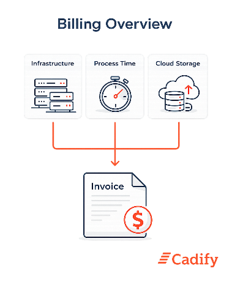

# Billing

Cadify applies a **utility-style billing model** designed to reflect real platform usage in a transparent and predictable way. The intent is to align invoicing with actual resource consumption, while keeping the model simple to understand for the Store Owner.

Billing in Cadify is based on three clearly separated components:

- Fixed infrastructure capacity
- Measured process time for executed services
- Measured cloud storage usage

All invoices are derived from **measured usage**, summarized over time, and presented in a structured and auditable form.

This section explains the principles behind Cadify billing. It does not describe pricing, rates, or payment workflows.

## Utility-based billing principle

Cadify billing follows the same fundamental logic as other utility services:
a combination of **fixed capacity** and **measured consumption**.

Fixed components represent infrastructure that must be available to operate the Cadify platform for a Store. Variable components represent actual usage generated by user activity and system services over time.

This separation ensures that:

- The Store Owner pays for capacity that is reserved and available.
- Variable costs scale with real usage, not with assumptions or flat tiers.
- Usage can be reviewed, explained, and verified after the fact.

## Infrastructure capacity

Infrastructure represents the fixed technical capacity required to run Cadify services for a Store.

Cadify distinguishes between infrastructure operated by Cadify and infrastructure operated by the customer. Both are relevant for billing, because both contribute to the total capacity that enables Cadify services.

Infrastructure components may include:

- **Cadify SW Server(s)**: Servers supporting Cadify service logic, coordination, and execution control.
- **Cadify Web Server(s)**: Servers providing web-based access, configuration interfaces, and integration with the Cadify platform.
- **Customer SW Server(s)**: Servers supporting Cadify service logic, coordination, and execution control, running on customer premises.
- **Customer Web Server(s)**: Servers providing web-based access, configuration interfaces, and integration with the Cadify platform, running on customer premises.

All SolidWorks execution runs on **customer-owned servers on customer premises only**. These customer servers are nevertheless counted as part of the overall infrastructure capacity associated with the Store.

Infrastructure is treated as a **fixed component** and is typically billed as server capacity per billing period.

Detailed descriptions of infrastructure components are provided in the [Infrastructure Components](./infrastructure.md) section.

## Measured usage: process time

The primary variable billing component in Cadify is **process time**.

Process time represents the measured execution time, in seconds, consumed by Cadify services when handling user-requested or system-initiated operations. All executed jobs are included, categorized by service type.

Cadify currently distinguishes between the following service categories:

- **RFQ - Request For Quote**: Processing triggered when a user submits an RFQ.
- **Product Calculate**: Processing triggered by product configuration and calculation requests.
- **Service monitoring**: Background processing related to monitoring, synchronization, and service health.

Each category represents a different type of workload and may be billed differently, but all are measured using the same underlying principle: **actual process time consumed**.

Further details are described in the Measured Usage (Process Time) section.

## Cloud storage usage

Cadify also measures **cloud storage usage** associated with a Store.

Storage usage is measured on a **weekly basis**, expressed as **average cloud storage usage during the week**. This approach smooths short-term fluctuations while accurately reflecting sustained storage consumption.

Storage measurements are usage data only. They do not represent backups, transient runtime data, or temporary execution artifacts unless explicitly defined as stored project data.

Details on what is included in storage measurement are described in the [Cloud Storage Measurement](./storage.md) section.

## Weekly measurement and monthly invoicing

Cadify separates **measurement cadence** from **invoice issuance**.

- Usage is measured and aggregated on a **weekly basis**.
- Invoices are issued on a **monthly basis**.

A monthly invoice therefore consists of the summarized usage from **three to five weekly billing bases**, depending on calendar alignment. Partial weeks not included in a previous invoice are carried forward and included in the next monthly invoice.

This approach ensures continuity, avoids gaps or overlaps, and provides a clear audit trail from measured usage to invoiced totals.

All invoices are based on **measured usage summarized per month**.

Further explanation of this aggregation model is provided in the [Weekly Usage and Monthly Invoicing](./aggregation.md) section.

## Transparency and traceability

Cadify billing is designed to be deterministic and explainable.

Measured usage is derived from platform execution records and usage statistics collected over time. These measurements form the basis for weekly usage summaries, which are then aggregated into monthly invoices.

The goal is not only correct billing, but also **trust**: Store Owners should be able to understand what is being measured, why it is measured, and how it contributes to the invoice.