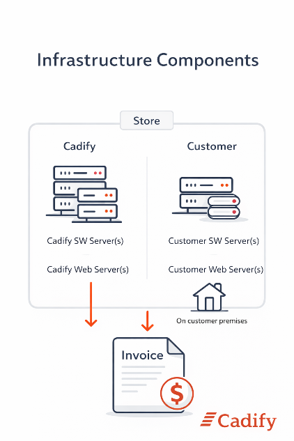

# Infrastructure Components

Infrastructure represents the **fixed technical capacity** required to operate Cadify services for a Store. Unlike measured usage, which varies over time, infrastructure reflects resources that must be continuously available to ensure reliable operation of the platform.

This section explains what Cadify means by infrastructure in a billing context, and why both Cadify-operated and customer-operated components are included.

## What infrastructure means in Cadify

In Cadify, infrastructure refers to server capacity that enables:

- Execution of Cadify services
- Secure separation between Stores
- Reliable availability of configuration, calculation, and monitoring functions

Infrastructure is **not usage-dependent**. It exists regardless of how frequently services are executed, and therefore forms the fixed component of the billing model.

## Cadify-operated infrastructure

Cadify operates central platform components that are shared across Stores, but logically isolated per Store.

These may include:

- **Cadify SW Server(s)**: Servers supporting Cadify service logic, coordination, and execution control.
- **Cadify Web Server(s)**: Servers providing web-based access, configuration interfaces, and integration with the Cadify platform.

These components represent infrastructure that Cadify must provision, operate, and maintain in order to deliver services to each Store.

## Customer-operated infrastructure

Certain Cadify services depend on infrastructure that is owned and operated by the customer.

This includes:

- **Customer SW Server(s)**: Servers supporting Cadify service logic, coordination, and execution control, running on customer premises.
- **Customer Web Server(s)**: Servers providing web-based access, configuration interfaces, and integration with the Cadify platform, running on customer premises.

All SolidWorks execution runs on **customer-owned servers on customer premises only**. This is a fundamental architectural and licensing constraint in Cadify.

Although these servers are owned and operated by the customer, they are an integral part of the Cadify service environment for the Store. As such, they are included when determining the total infrastructure capacity associated with that Store.

From a billing perspective, this reflects the fact that Cadify services reserve, coordinate, and rely on these resources as part of the overall platform operation.

## Why customer infrastructure is included

Including customer-operated infrastructure is not about charging for hardware ownership. It is about acknowledging **reserved service capacity**.

Cadify services are designed and configured around a specific infrastructure footprint per Store. This footprint defines:

- Which services can run
- Where execution can occur
- How workloads are isolated and managed

Once infrastructure is assigned to a Store, it represents capacity that is logically dedicated and cannot be freely reused elsewhere. This is why infrastructure is treated as a fixed billing component, independent of actual usage volume.

## Infrastructure as a fixed billing component

Infrastructure components are typically billed as **server capacity per billing period**, using clearly defined units (for example, number of servers).

They do not fluctuate with:

- Number of executed jobs
- Execution duration
- Short-term activity spikes

This separation ensures that variable usage charges remain transparent and directly linked to measurable consumption, while infrastructure costs remain stable and predictable.

## Relationship to usage-based billing

Infrastructure enables Cadify services to run. Usage-based billing reflects how much those services are actually used.

Both are required for a complete and fair billing model:

- Infrastructure ensures availability and readiness.
- Process time and storage reflect actual workload and data volume.

The interaction between these components is intentional and forms the basis of Cadify’s utility-style billing approach.

## Summary

Infrastructure in Cadify represents the fixed server capacity required to operate services for a Store. It includes both Cadify-operated and customer-operated servers, because both are essential to the delivery of Cadify functionality.

By separating infrastructure from measured usage, Cadify ensures a billing model that is transparent, predictable, and aligned with real platform behavior.