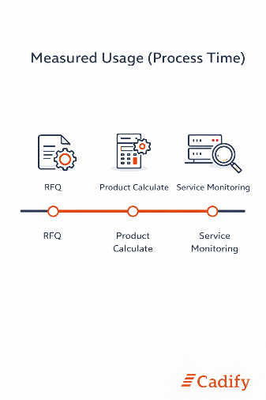

# Measured Usage (Process Time)

Process time is the primary **usage-based component** in Cadify billing. It represents the actual execution time consumed by Cadify services when handling requests for a Store.

Unlike infrastructure, which is fixed, process time varies with activity and reflects how much the platform is used over time.

## What process time represents

Process time measures the **elapsed execution time**, in seconds, consumed when Cadify performs work on behalf of a Store. This includes both user-initiated actions and system-level services that are required to operate the platform reliably.

Every time a Cadify service executes a task, the consumed execution time is recorded and contributes to measured usage.

Process time is:

- Measured objectively
- Aggregated over time
- Categorized by service type

This makes it suitable as a transparent and auditable usage metric.

## Service categories

Cadify distinguishes between different types of services when measuring process time. Each category represents a distinct type of workload with different characteristics.

## RFQ - Request For Quote

RFQ process time is generated when a user submits a **Request For Quote**.

This includes the processing required to:

- Interpret the request
- Execute associated calculations
- Prepare configuration and status data required for quotation handling

RFQ processing reflects direct customer or sales activity and is measured whenever such requests are executed.

## Product Calculate

Product Calculate process time is generated when Cadify performs **product configuration and calculation tasks**.

This typically includes:

- Parameter evaluation
- Rule execution
- Model-related calculations triggered by configuration changes

Product Calculate represents the core computational workload associated with product configuration and is often the dominant source of process time usage.

## Service monitoring

Service monitoring process time represents **background and system-level activity** required to operate Cadify services.

This includes processing related to:

- Monitoring execution status
- Synchronization and coordination between services
- Ensuring service availability and integrity

Although not always directly visible to users, service monitoring is an essential part of providing a reliable and responsive platform.

## Inclusion of executed jobs

All executed jobs contribute to measured process time.

Cadify does not attempt to estimate or predict usage. Instead, billing is based on **actual executed work**, recorded as it occurs. Different service categories may have different cost characteristics, but they are all measured using the same underlying principle.

This approach ensures that measured usage reflects real platform behavior rather than assumptions or fixed tiers.

## Measurement and aggregation

Process time is recorded at execution level and aggregated over time.

Usage is summarized on a **weekly basis**, forming part of the weekly usage data for a Store. These weekly measurements are later combined into monthly invoice summaries, together with infrastructure and storage components.

The aggregation model is explained further in the Weekly Usage and Monthly Invoicing section.

## Why process time is used

Using process time as a billing metric ensures that:

- Usage scales with actual workload
- Short and long-running operations are treated proportionally
- Billing remains explainable and verifiable

Process time provides a direct link between platform activity and usage-based billing, supporting Cadify’s utility-style billing model.

## Summary

Process time represents the measured execution time consumed by Cadify services. It is categorized by service type and aggregated over time to form the variable usage component of Cadify billing.

Together with infrastructure and cloud storage, process time forms one of the three pillars of Cadify’s billing model.