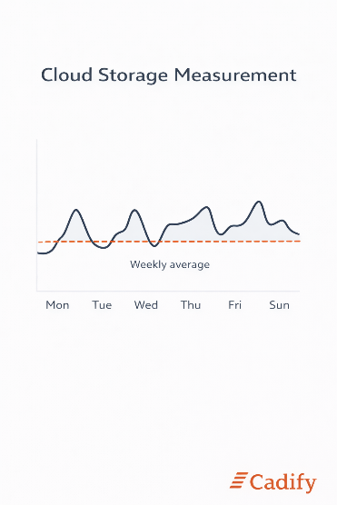

# Cloud Storage Measurement

Cloud storage is a **usage-based component** in Cadify billing that reflects the amount of data associated with a Store over time. Unlike process time, which measures execution activity, storage represents the persistent data footprint maintained by the platform.

This section explains how cloud storage is measured and how it contributes to usage-based billing.

## What cloud storage represents

Cloud storage represents the **persistent data stored in the Cadify cloud environment** for a Store.

This includes data that must be retained to support:

- Active projects
- Published product definitions
- Configuration data and related assets

Cloud storage does not represent transient or short-lived data created during execution unless that data is explicitly retained as part of a Store’s project data.

## Weekly storage measurement

Cloud storage usage is measured on a **weekly basis**.

For each week, Cadify records the **average cloud storage usage during that week**. Using an average value smooths short-term fluctuations and provides a fair representation of sustained storage consumption.

Weekly measurement ensures that storage usage is captured continuously, even when data volumes change over time.

## Monthly invoicing based on weekly data

Although storage is measured weekly, invoices are issued on a **monthly basis**.

A monthly invoice includes the summarized storage usage from all weekly measurements that fall within the invoicing period. Depending on calendar alignment, this typically results in **three to five weekly storage measurements** contributing to a single monthly invoice.

Partial weeks not included in a previous invoice are carried forward and included in the next invoice, ensuring continuity without gaps or double counting.

## What is not included

To maintain clarity and avoid double counting, certain types of data are not treated as billable cloud storage unless explicitly defined otherwise.

This typically excludes:

- Temporary execution artifacts
- Transient runtime data
- Intermediate processing folders

Only data that represents persistent storage for the Store is included in cloud storage measurement.

## Relationship to other billing components

Cloud storage is complementary to the other billing components:

- **Infrastructure** ensures that storage services are available.
- **Process time** reflects how much computational work is performed.
- **Cloud storage** reflects how much data is retained over time.

By separating these components, Cadify provides a billing model where each cost driver is measured independently and transparently.

## Summary

Cloud storage measurement reflects the persistent data footprint associated with a Store. Usage is measured weekly as average storage usage and summarized into monthly invoices together with infrastructure and process time.

This approach ensures that storage-related billing is stable, predictable, and aligned with real platform behavior.