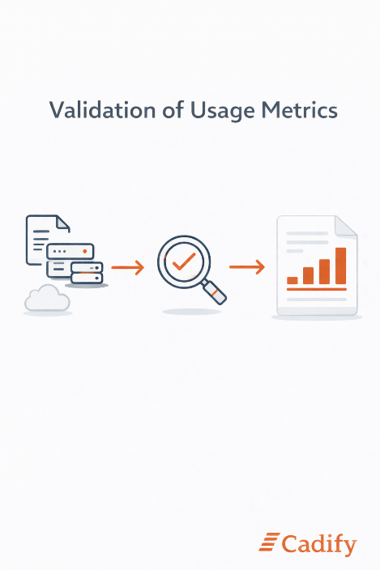

# Validation of Usage Metrics

Cadify places strong emphasis on the correctness, consistency, and traceability of all usage metrics used for billing.

Usage metrics are validated through **manual verification** based on underlying file data and execution records. This includes recalculating measured values directly from source data, reviewing execution logs, and confirming storage figures against actual stored file sizes. Validation is performed on aggregated results as well as on selected individual records to ensure internal consistency.

This approach allows Cadify to:

- Verify that measurement logic behaves as intended
- Detect anomalies or unexpected patterns
- Confirm that aggregated usage accurately reflects underlying activity

All usage included in an invoice is therefore based on **observable and reproducible data**, not estimates or inferred behavior.

As Cadify evolves, parts of this validation process may be supported by additional tooling. However, the governing principle remains unchanged: **billing is grounded in verifiable data that can be manually reviewed and confirmed**.