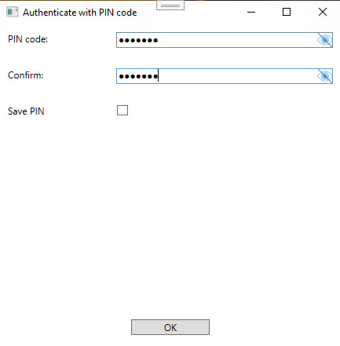

# Authorization

Since Cadify closely integrates with third-party software (SolidWorks, Microsoft Excel), license compliance is a cornerstone in architectural and development considerations. SolidWorks has a very strict part in its license forbiding any fully automated invocations of SolidWorks, or as they call it, using SolidWorks as a service bureau.

To comply with SolidWorks license terms and to prepare Cadify Service to work with any kind of restrictions, a strict authorization flow was implemented. This authorization flow requires an in-office **operator** to manually authorize every job before Cadfiy Service can start it. Authorization applies only for the current session (if Cadify Service gets closed, authorized jobs need to be authorized again) to strictly include manual **operator** supervision in every case.

## PIN Code

To ensure only an authorized **operator** can authorize jobs, Cadify Service requires to set up a PIN code before starting. The PIN code is then used by the **operator** to authenticate before authorizing jobs.

The rationale of using a separate PIN code is password sensitivity. Since Cadify Web passwords are usually long and more sensitive, using them as a PIN or sharing them with operators is not always feasible. To overcome this issue, a separate PIN code with weaker validation rules can be set on startup:

The new PIN window form hosts the following inputs:
- **PIN code**: The PIN code to be used by the operators.
- **Confirm**: The same PIN code to avoid typos.
- **Save PIN**: Save the PIN code for later use. If the PIN code is saved, the previous form fields get filled automatically next time.

> PIN codes are not saved or stored in plaintext format anywhere. Cadify Service uses the hash of the PIN code to authenticate operators. If the PIN code is saved for later use, Cadify Service saves the PIN code to Windows' Crendential Manager. Due to hashing, both setting a new PIN and authentication can take a few seconds.

## Authorizing jobs

When a new job arrives into the [Job Manager](./jobman.md), the **operator** is required to authorize the job before it can be started by Cadify Service. This can be done with the green **Authorize** control button in the Job Manager.

Once the last PIN authentication of the **operator** is expired (by default a PIN authentication expires in 30 seconds), the **operator** is required to authenticate with the PIN code using a PIN authentication window:

The PIN authentication window hosts the following inputs:
- **PIN code**: The PIN code set up before starting the service.

After a successful authentication, the job triggering the process get authorized automatically. In the expiration period, the **operator** is allowed to authorize any other jobs without authenticating with the PIN code.