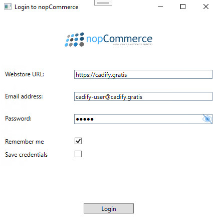

# Connecting to a Store

If Cadify Service is not connected to a Cadify-enabled nopCommerce web store (Cadify Web), it cannot accept model generation requests (jobs). In such case, Cadify Service triggers a login required system notification.

## Login window

If there is no logged in user, the Cadify Service context menu's **Log in** menu item is available. By clicking on it, the login window pops up, allowing to fill a login form and connect to a store with a valid and authorized Cadify Web user.

> Login credentials in the form are for presentation purposes only, they do not belong to a real Cadify store backed with Cadify Service.

The login window's form hosts the following inputs:
- **Webstore URL**: A URL pointing to a Cadify Web store. The URL does not need to be a base URL, but the page it points to must be part of a Cadify Web store.
- **Email address**: The Cadify Web user's email address or user name. The user must have appropriate roles to start Cadify Service. The user is authorized by Cadify Web, not Cadify Service.
- **Password**: The Cadify Web user's password. Visibility of the password can be toggled with the eye icon on the right side of the input field.
- **Remember me**: If checked, Cadify Service saves the (cookie) access token returned by Cadify Web. It allows Cadify Service to log in for a limited time period automatically without prompting the login form again.
- **Save credentials**: If checked, Cadify Service saves the provided email address and password using Windows' credential manager. It fills back the form on future login attempts.

The login window's form gives visual validation feedback. If an input field's border turns red, its value is invalid for some reason. If it turns green, the form input is valid. If invalid, Cadify Service tries to explain the reasons with red feedback messages.

## On a successful login

If a user manages to successfully log into a Cadify Web store, Cadify Service gains access to the store's Cadify Cloud storage. It starts synchronizing the necessary files immediately. During synchronization, Cadify Service starts enqueuing jobs, but it cannot start model generations yet. Cadify Service synchrnozies the following resources:
- Product files. Cadify Models and Cadify Tables related to products.
- Library files. Shared parts, assemblies, images, and other sketcher resources used in model generations.

Once Cadify Service is done with synchrnoziation, it triggers a service started system notification:

> Product and library files are kept in sync (resynchronized) while Cadify Service is running if a change is detected. During these smaller synchrnoziation events, jobs are paused.