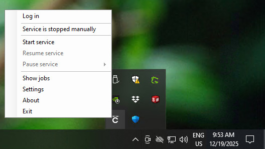
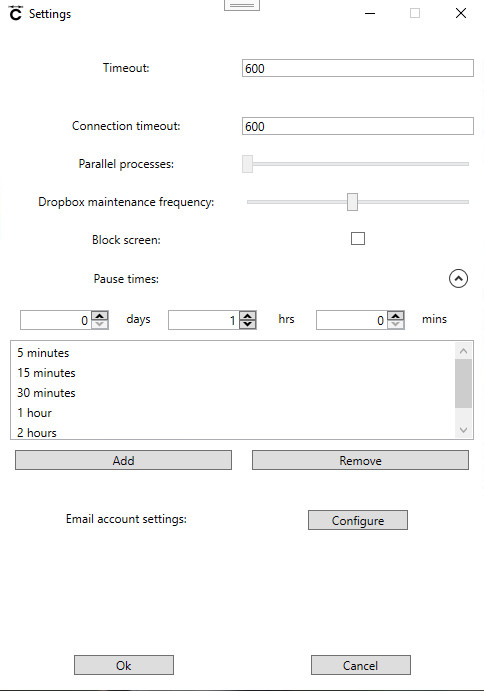
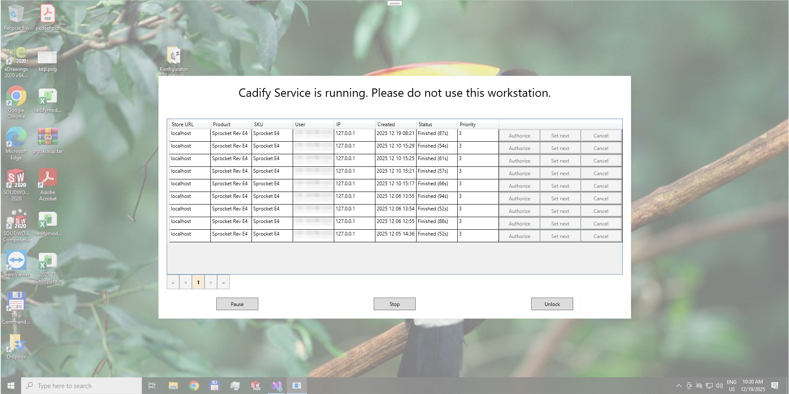
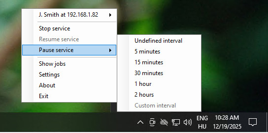

# Settings

Cadify Service has several tunable features through its Settings window. The settings window is available through the **context menu** by clicking on **Settings**.

## Simple settings

Once the Settings window is opened, users can see avaiable options grouped in two sections. The first section (above the expandable content) contains simple settings.

### Timeout

**Timeout** defines how much time Cadify Service waits for a job to complete before halting it. It must be set carefully, as if a model with its drawings cannot be generated under this threshold value by SolidWorks, all jobs will time out and fail.

The **Timeout** value is expressed in seconds.

The reason behind the **Timeout** parameter is that neither SolidWorks nor Microsoft Excel can reliably communicate if they are stuck mid-process or halted due to an error. Cadify Service has no other way to determine when to forcefully stop those processes if they fail to complete their tasks.

> The **Timeout** parameter is used as a fallback or default value by Cadify Service. If a product has enough successful generations to calculate an average estimated time to complete, then 150% of that time is used as timeout threshold. 

### Connection timeout

**Connection timeout** defines how much time Cadify Service waits for Cadify Cloud if it cannot estabilish a connection. Typical reasons behind the unability to connect is Cadify Cloud downtime or local Internet connection issues. Until the **Connection timeout** threshold value is reached, Cadify Service cannot time out a job in the file upload phase.

The **Connection timeout** value is expressed in seconds.

The reason behind the **Connection timeout** parameter is that Cadify Service must be able to upload generated files to Cadify Cloud before moving to the next job. If Cadify Service cannot estabilish a connection to Cadify Cloud, it must not wait indefinitely for the connection.

### Parallel processes

Cadify Service is prepared to run multiple jobs in parallel to speed up generations and product serving. Unfortunately, neither SolidWorks, nor Microsoft Excel support parallel processing Cadify products.

Until all third-party integrations support parallel processing in a feasible way for Cadify, the **Parallel processes** option is locked to **1**.

### Cadify Cloud maintenance frequency

Cadify Cloud uses cloud vendors to store and serve Cadify files, including job requests and generation results. Due to implementation details in service provider APIs, some reqests can go undetected in certain circumstances.

To avoid losing generation requests, Cadify Service scans Cadify Cloud for any undetected job requests in intervals defined by the **Cadify Cloud maintenance frequency** option. The lower it is, the more often Cadify Service does extra scans to Cadify Cloud.

The **Cadify Cloud maintenance frequency** value is expressed in seconds.

> It is recommended to keep **Cadify Cloud maintenance frequency** above 30, as too frequent scanning can result in rate limiting by the service provider and slowing down Cadify Service.

### Block screen

Screen blocking is a convenience functionality in Cadify Service where a full-screen job manager stays active all the time. This allows operators to see currently running jobs without any disturbances from the operating system or other installed software (including SolidWorks and Microsoft Excel).

When screen blocking is on, operators can freely manage running jobs, pause and resume Cadify Service, and stop screen blocking if they need to access any other system functionality on the workstation.

> Screen blocking was designed to alert any company personnel sharing the same workstation that Cadify Service is currently running and serving job requests. By bringing Cadify Service to the front, the chance of accidently running a process which might hurt finishing jobs is minimized.

## Cadify Service state management

Cadify Service internal states can be managed through its **context menu** by clicking on the appropriate items.

### Start service

Starts the service, if it's stopped but a connection to a Cadify Web store is active. Cadify Service cannot be started if there is no active connection or it is already started.

### Pause service

Pauses the service for a predefined interval. If the chosen interval is definite, Cadify Service will automatically resume to work after it. The available intervals can be modified through the **Settings** window under the **Pause times** expandable section.

> If the service is paused for a definite interval, the resume time is communicated with users on Cadify Web stores connected to the current service.

### Resume service

Resumes the service if it is currently paused. Manual resuming is only mandatory if the service has been paused indefinitely.

## Email account

Cadify Service can be configured with an SMTP email account for sending emails. This configuration is essential for quick fault reactions. If Cadify Service encounters an error requiring user intervention, it sends out an email using the email configuration.

The **To Emails**, **CC Emails**, and **BCC Emails** input fields contain the recipient addresses in case of serious Cadfiy Service faults. Those addressess will receive notifications with the error and suggested ways to troubleshoot.

The rest of the form fields are required for the SMTP connection. It must contain correct values for the sender's account.

> It is recommended to test the provided values with the **Test Connection** button before relying on automatic error email notifications.